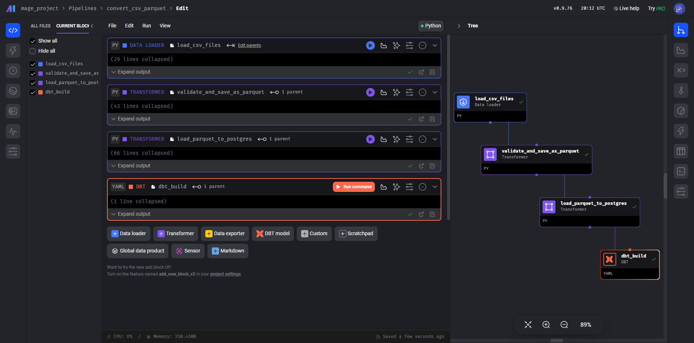

#  Narrowstack Case - Data Pipeline with Mage, PostgreSQL, MinIO, dbt, and Metabase

## How to Run the Project
<details>

<summary>Content</summary>  
<br>
This project implements a complete data pipeline using the following tools:

- **MageAI - CSV ingestion**: Imports CSV files and stores them as Parquet files in **MinIO**.
- **MageAI - Data loading**: Loads the Parquet files into a **PostgreSQL** database.
- **dbt - Transformations**: Executes **dbt** models for data transformation.
- **Metabase - Analytics**: Serves dashboards and reports through **Metabase**.

---

## How to Run This Project Locally

Follow these steps to run the complete data stack using Docker.

### 1. Prerequisites

Ensure the following tools are installed:

- [Docker](https://docs.docker.com/get-docker/)

### 2. Project Structure

First, clone this repository:

```bash
git clone https://github.com/marcosboscariol/narrow_stack_case
cd narrow_stack_case
```

The project should have the following structure:

```plaintext
.
├── data/
│   └── csv/
│       ├── clientes.csv
│       ├── itens_vendas.csv
│       ├── produtos.csv
│       └── vendas.csv
├── mage/
│   └── ... (your Mage pipeline files)
    └── dbt_narrowstack
├── docker-compose.yml
├── Dockerfile
```

### 3. Running the Project with Docker

Wait for all containers to be fully up and running before proceeding. Then, follow these steps to start the entire stack using Docker:

```bash
docker compose up -d
```

This will start the following services:

- **Postgres:** for storing data

- **MinIO:** for object storage (S3-compatible)

- **Mage:** for the ETL pipelines

- **Metabase:** for data visualization

- **dbt:** for data transformation

### Access Mage AI

Open your browser and go to:

```bash
http://localhost:6789
```

Inside Mage AI:

- Navigate to the pipeline named `convert_csv_parquet`.
- Choose the desired trigger to schedule the pipeline or run it manually by clicking the **Run** button.

This pipeline will import the CSV files and convert them to Parquet format, storing them in MinIO.

After, it will insert the parquet files into a postgres database and finally will build a dbt transformation process.

### Optional: Verify Parquet Files in MinIO

MinIO provides a web interface to browse and verify the stored Parquet files.

- Open your browser and navigate to:

```bash
http://localhost:9001
```

- Login with:

  - **Username:** `minioadmin`
  - **Password:** `minioadmin`

- Browse to the bucket named `mage-bucket` and check the `parquet/` folder to see the uploaded Parquet files.

### Verify dbt Transformations

After running the dbt transformations, you can verify that everything worked as expected:

- Check stg and data_mart tables:

```bash
docker exec -it postgres psql -U postgres -d dbt -c \dt
```
Verify it you have these tables:

```plain
Schema |      Name       | Type  |  Owner
--------+-----------------+-------+----------
 public | clientes        | table | postgres
 public | dm_dim_cliente  | table | postgres
 public | dm_dim_produtos | table | postgres
 public | dm_fact_vendas  | table | postgres
 public | itens_vendas    | table | postgres
 public | produtos        | table | postgres
 public | vendas          | table | postgres
```

- Query transformed data:

```bash
docker exec -it postgres psql -U postgres -d dbt -c "SELECT * FROM data_mart.dm_fact_vendas LIMIT 10;"
```
### Access Metabase

Metabase is available at:  
```bash
http://localhost:3001
```

You can explore the data, create dashboards, and visualize your transformed datasets as you prefer.
</details>

## Overview of Key Tools
<details>
<summary>Content</summary>

### Mage AI

Mage AI is an open-source data pipeline tool that allows you to build, schedule, and monitor ETL pipelines with ease.  
In this project, Mage AI is responsible for:
- Importing raw CSV data,
- Converting CSV files into Parquet format,
- Uploading Parquet files to MinIO (an S3-compatible storage).
- Upload the PArquer files from MinIO to Postgres
- Build a dbt Transformation flow

You can interact with Mage AI through its web interface to trigger pipelines manually or set up automated schedules.



### dbt

dbt (data build tool) is used to transform raw data in your database into clean, structured tables. It runs SQL queries to create tables and views for analytics.

- In this project, dbt:
- Builds staging (stg_) tables to clean raw data
- Creates data marts (dm_) for reporting
- Runs tests to check data quality
- Manages transformations inside the Docker setup

In this project, the final data modeling is implemented and delivered using dbt.


### Metabase

- Metabase is the data visualization layer of the project. It connects directly to the Postgres database and lets you explore your data with dashboards, charts, and queries — no SQL required.
- You can use it to build interactive dashboards and generate reports based on the transformed data.
- Feel free to explore and customize your analytics experience as needed.


</details>
